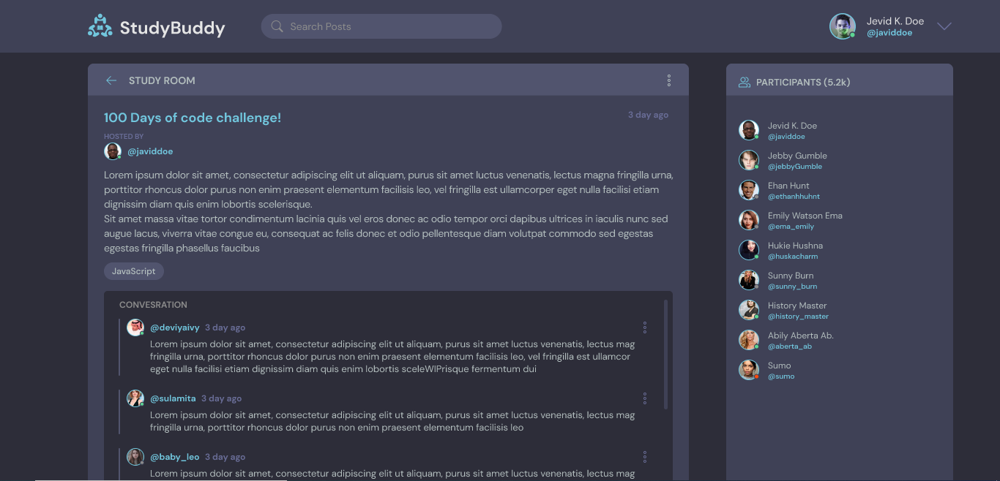

# 📚 Study Bud

Study Bud is a collaborative study platform that allows users to create, join, and manage study rooms. It’s built using Django and provides features like real-time discussions, resource sharing, and topic-wise study spaces.

---

## ✨ Features

- 🔐 User Authentication (Login/Signup)
- 🏠 Home Page with all available study rooms
- 📝 Create, update, and delete rooms
- 📚 Join and interact in study rooms
- 🔍 Search rooms by topics or keywords
- 🧵 Add messages to discussions
- 🌐 Responsive UI

---

## 🛠️ Tech Stack

- **Backend:** Python, Django
- **Frontend:** HTML, CSS, Bootstrap (or Tailwind, if applicable)
- **Database:** SQLite
- **Tools:** Git, GitHub, VS Code

---

## 🧑‍💻 Cloning the Repository

--> Clone the repository using the command below:

```bash
git clone https://github.com/mahakrastogi0602/studybud.git
```  

--> Move into the directory where we have the project files:

```bash
cd studybud
```

--> Create a virtual environment :

```bash
# Let's install virtualenv first
pip install virtualenv

# Then we create our virtual environment
virtualenv envname
```

--> Activate the virtual environment:

```bash
envname\Scripts\activate  # For Windows
# OR
source envname/bin/activate  # For macOS/Linux
```

--> Install the requirements:

```bash
pip install -r requirements.txt
```

🚀 Running the App

--> To run the App, use:

```bash
python manage.py runserver
```
> ⚠️ **Note:** Then, the development server will be started at: http://127.0.0.1:8000/


## 🖼️ App Preview 

### Feed Home PAge



### Room Conversation Preview


## 🚀 Live Demo

Check out the live version of the project here:  
🔗 [StudyBud Live on Render](https://studybud-u9sw.onrender.com/)


